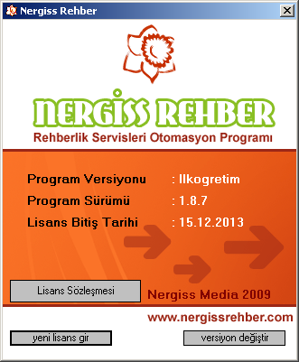

# Nergiss Rehber
## Okul Rehberlik Servisleri Otomasyonu

* 2008 senesinde VB6 ile yazmaya başlayıp 2009 senesinde satışa sunduğum rehberlik programıdır. 

* Ticari bir program olduğu için kodlarını burada paylaşamamaktayım. Ancak programdan bazı ekran görüntüleri aşağıdadır.

* Programda veritabanı olarak Access kullanıldı. İnternet üzerinden güncelleme özelliği vardı.

* Programa ait optik formlar vardı. Rehber öğretmenlerin uyguladığı testler bu optik formlar aracılığı ile programa işlenmekteydi.

  

  

  

  

  

  

  

  

  

  

  

  

  

  

  
